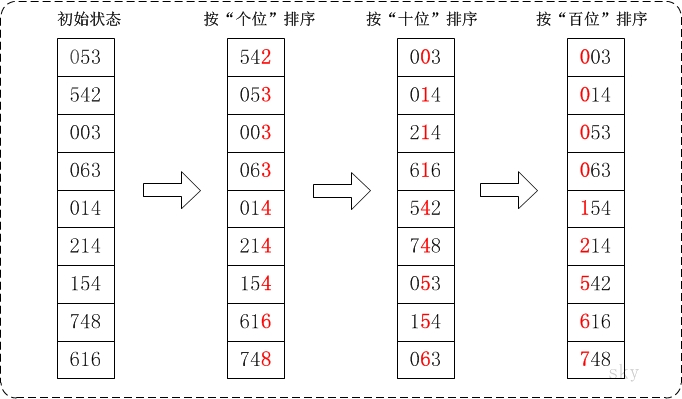
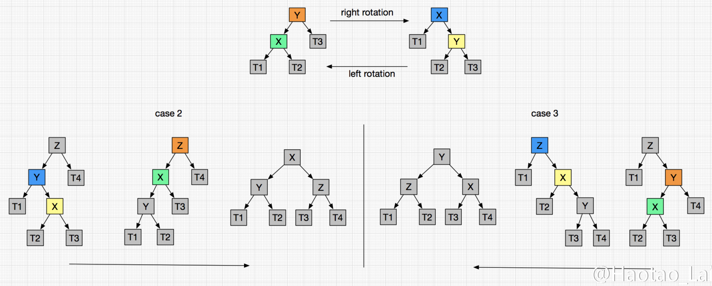

<!-- START doctoc generated TOC please keep comment here to allow auto update -->
<!-- DON'T EDIT THIS SECTION, INSTEAD RE-RUN doctoc TO UPDATE -->


- [常用算法及模板](#%E5%B8%B8%E7%94%A8%E7%AE%97%E6%B3%95%E5%8F%8A%E6%A8%A1%E6%9D%BF)
  - [二分查找](#%E4%BA%8C%E5%88%86%E6%9F%A5%E6%89%BE)
  - [滑动窗口](#%E6%BB%91%E5%8A%A8%E7%AA%97%E5%8F%A3)
  - [回溯算法](#%E5%9B%9E%E6%BA%AF%E7%AE%97%E6%B3%95)
  - [跳舞链](#%E8%B7%B3%E8%88%9E%E9%93%BE)
    - [解数独](#%E8%A7%A3%E6%95%B0%E7%8B%AC)
    - [解n皇后问题](#%E8%A7%A3n%E7%9A%87%E5%90%8E%E9%97%AE%E9%A2%98)
  - [递归、动态规划、贪心、记忆化](#%E9%80%92%E5%BD%92%E5%8A%A8%E6%80%81%E8%A7%84%E5%88%92%E8%B4%AA%E5%BF%83%E8%AE%B0%E5%BF%86%E5%8C%96)
    - [递归](#%E9%80%92%E5%BD%92)
    - [动态规划](#%E5%8A%A8%E6%80%81%E8%A7%84%E5%88%92)
    - [贪心](#%E8%B4%AA%E5%BF%83)
    - [记忆化](#%E8%AE%B0%E5%BF%86%E5%8C%96)
  - [并查集 (Union/Find set)](#%E5%B9%B6%E6%9F%A5%E9%9B%86-unionfind-set)
  - [线段树](#%E7%BA%BF%E6%AE%B5%E6%A0%91)
- [排序](#%E6%8E%92%E5%BA%8F)
  - [选择排序：](#%E9%80%89%E6%8B%A9%E6%8E%92%E5%BA%8F)
  - [插入排序：](#%E6%8F%92%E5%85%A5%E6%8E%92%E5%BA%8F)
  - [快速排序](#%E5%BF%AB%E9%80%9F%E6%8E%92%E5%BA%8F)
  - [归并排序](#%E5%BD%92%E5%B9%B6%E6%8E%92%E5%BA%8F)
  - [堆排序(优先队列)](#%E5%A0%86%E6%8E%92%E5%BA%8F%E4%BC%98%E5%85%88%E9%98%9F%E5%88%97)
  - [桶排序(哈希排序、分配排序)](#%E6%A1%B6%E6%8E%92%E5%BA%8F%E5%93%88%E5%B8%8C%E6%8E%92%E5%BA%8F%E5%88%86%E9%85%8D%E6%8E%92%E5%BA%8F)
  - [基数排序](#%E5%9F%BA%E6%95%B0%E6%8E%92%E5%BA%8F)
  - [Shell排序](#shell%E6%8E%92%E5%BA%8F)
- [链表](#%E9%93%BE%E8%A1%A8)
- [栈、队列](#%E6%A0%88%E9%98%9F%E5%88%97)
- [哈希表](#%E5%93%88%E5%B8%8C%E8%A1%A8)
- [树相关算法及数据结构](#%E6%A0%91%E7%9B%B8%E5%85%B3%E7%AE%97%E6%B3%95%E5%8F%8A%E6%95%B0%E6%8D%AE%E7%BB%93%E6%9E%84)
  - [二叉树遍历模板](#%E4%BA%8C%E5%8F%89%E6%A0%91%E9%81%8D%E5%8E%86%E6%A8%A1%E6%9D%BF)
    - [__深度优先遍历__（前、中、后序遍历）](#__%E6%B7%B1%E5%BA%A6%E4%BC%98%E5%85%88%E9%81%8D%E5%8E%86__%E5%89%8D%E4%B8%AD%E5%90%8E%E5%BA%8F%E9%81%8D%E5%8E%86)
    - [__广度优先遍历__（层次遍历）](#__%E5%B9%BF%E5%BA%A6%E4%BC%98%E5%85%88%E9%81%8D%E5%8E%86__%E5%B1%82%E6%AC%A1%E9%81%8D%E5%8E%86)
  - [二叉查找树 (BST)](#%E4%BA%8C%E5%8F%89%E6%9F%A5%E6%89%BE%E6%A0%91-bst)
  - [AVL树](#avl%E6%A0%91)
  - [红黑树 (R-B Tree)](#%E7%BA%A2%E9%BB%91%E6%A0%91-r-b-tree)
  - [堆（优先队列）](#%E5%A0%86%E4%BC%98%E5%85%88%E9%98%9F%E5%88%97)
  - [字典树 (Trie 前缀树)](#%E5%AD%97%E5%85%B8%E6%A0%91-trie-%E5%89%8D%E7%BC%80%E6%A0%91)
  - [哈夫曼树](#%E5%93%88%E5%A4%AB%E6%9B%BC%E6%A0%91)
  - [树状数组和线段树](#%E6%A0%91%E7%8A%B6%E6%95%B0%E7%BB%84%E5%92%8C%E7%BA%BF%E6%AE%B5%E6%A0%91)
  - [2-3树](#2-3%E6%A0%91)
  - [B/B+树](#bb%E6%A0%91)
- [图相关算法](#%E5%9B%BE%E7%9B%B8%E5%85%B3%E7%AE%97%E6%B3%95)
  - [图的两种表示方式](#%E5%9B%BE%E7%9A%84%E4%B8%A4%E7%A7%8D%E8%A1%A8%E7%A4%BA%E6%96%B9%E5%BC%8F)
  - [拓扑排序](#%E6%8B%93%E6%89%91%E6%8E%92%E5%BA%8F)
  - [深度优先搜索](#%E6%B7%B1%E5%BA%A6%E4%BC%98%E5%85%88%E6%90%9C%E7%B4%A2)
  - [广度优先搜索](#%E5%B9%BF%E5%BA%A6%E4%BC%98%E5%85%88%E6%90%9C%E7%B4%A2)
  - [Uniform Cost Search 和 A* Search](#uniform-cost-search-%E5%92%8C-a-search)
  - [MST (Minium Spanning Tree)](#mst-minium-spanning-tree)
    - [Kruskal 算法 (并查集+贪心)](#kruskal-%E7%AE%97%E6%B3%95-%E5%B9%B6%E6%9F%A5%E9%9B%86%E8%B4%AA%E5%BF%83)
    - [Prim 算法 (贪心)](#prim-%E7%AE%97%E6%B3%95-%E8%B4%AA%E5%BF%83)
  - [最短路径](#%E6%9C%80%E7%9F%AD%E8%B7%AF%E5%BE%84)
    - [Dijkstra 算法 (优先队列、动态规划)](#dijkstra-%E7%AE%97%E6%B3%95-%E4%BC%98%E5%85%88%E9%98%9F%E5%88%97%E5%8A%A8%E6%80%81%E8%A7%84%E5%88%92)
    - [Floyd算法](#floyd%E7%AE%97%E6%B3%95)
    - [Bellman-Ford 算法](#bellman-ford-%E7%AE%97%E6%B3%95)
  - [欧拉路径/回路](#%E6%AC%A7%E6%8B%89%E8%B7%AF%E5%BE%84%E5%9B%9E%E8%B7%AF)
- [P/NP 问题](#pnp-%E9%97%AE%E9%A2%98)
- [位运算](#%E4%BD%8D%E8%BF%90%E7%AE%97)
  - [常用位运算操作](#%E5%B8%B8%E7%94%A8%E4%BD%8D%E8%BF%90%E7%AE%97%E6%93%8D%E4%BD%9C)
  - [位运算技巧](#%E4%BD%8D%E8%BF%90%E7%AE%97%E6%8A%80%E5%B7%A7)
  - [实战应用](#%E5%AE%9E%E6%88%98%E5%BA%94%E7%94%A8)
- [一些经典算法问题](#%E4%B8%80%E4%BA%9B%E7%BB%8F%E5%85%B8%E7%AE%97%E6%B3%95%E9%97%AE%E9%A2%98)
- [数学问题](#%E6%95%B0%E5%AD%A6%E9%97%AE%E9%A2%98)
- [背包九讲](#%E8%83%8C%E5%8C%85%E4%B9%9D%E8%AE%B2)
- [一些常考的C++代码题](#%E4%B8%80%E4%BA%9B%E5%B8%B8%E8%80%83%E7%9A%84c%E4%BB%A3%E7%A0%81%E9%A2%98)
  - [线程安全的单例类实现](#%E7%BA%BF%E7%A8%8B%E5%AE%89%E5%85%A8%E7%9A%84%E5%8D%95%E4%BE%8B%E7%B1%BB%E5%AE%9E%E7%8E%B0)
  - [shared_ptr 实现](#shared_ptr-%E5%AE%9E%E7%8E%B0)
  - [strcpy() 和 strncpy() 实现](#strcpy-%E5%92%8C-strncpy-%E5%AE%9E%E7%8E%B0)
  - [memcpy() 和 memmove() 实现](#memcpy-%E5%92%8C-memmove-%E5%AE%9E%E7%8E%B0)
  - [LRU 哈希链表实现](#lru-%E5%93%88%E5%B8%8C%E9%93%BE%E8%A1%A8%E5%AE%9E%E7%8E%B0)
- [一些面试问题](#%E4%B8%80%E4%BA%9B%E9%9D%A2%E8%AF%95%E9%97%AE%E9%A2%98)

<!-- END doctoc generated TOC please keep comment here to allow auto update -->


# 常用算法及模板

## 二分查找

1. 二分查找是一个看起来原理很简单，但是实现起来边边角角很麻烦的算法。
1. 一般要求时间复杂度为 _logn_ 的题目基本都需要二分查找。
2. 基于 __LeetCode34. 在排序数组中查找元素的第一个和最后一个位置__ 题解  
    详细内容：https://leetcode-cn.com/problems/find-first-and-last-position-of-element-in-sorted-array/solution/er-fen-cha-zhao-suan-fa-xi-jie-xiang-jie-by-labula/  
    作者：labuladong
    来源：力扣（LeetCode）

3. 例子
    - 最基本的二分查找-寻找一个数
        ```Java
        int binarySearch(int[] nums, int target) {
            int left = 0; 
            int right = nums.length - 1; // 注意

            while(left <= right) {
                int mid = (right + left) / 2;
                if(nums[mid] == target)
                    return mid; 
                else if (nums[mid] < target)
                    left = mid + 1; // 注意
                else if (nums[mid] > target)
                    right = mid - 1; // 注意
                }
            return -1;
        }
        ```
        这里left <= right 的原因是right的初始值是nums.length-1. 这个框架可以保证二分查找的正确性，即：不会漏查也不会溢出. 但是缺陷在于无法找到目标值的左右边界(像Leetocde 34这种情况).  

    - 寻找 __左侧边界__ 的二分查找
        ```Java
        int left_bound(int[] nums, int target) {
            if (nums.length == 0) return -1;
            int left = 0;
            int right = nums.length; // 注意
            
            while (left < right) { // 注意
                int mid = (left + right) / 2;
                if (nums[mid] == target) {  //这里很重要
                    right = mid;
                } else if (nums[mid] < target) {
                    left = mid + 1;
                } else if (nums[mid] > target) {
                    right = mid; // 注意
                }
            }
            return left;
        }
        ```
        - 正确性：此时循环体判断条件为left < right, 因为right初始值为nums.length。搜索区间是[left, right)，左闭右开，所以left = mid + 1; right = mid;   
        - 为什么能找到左边界：这里重要的地方在于当nums[mid] == target时，不返回mid，而是令right = mid;可见，找到 target 时不要立即返回，而是缩小「搜索区间」的上界 right，在区间 [left, mid) 中继续搜索，即不断向左收缩，达到锁定左侧边界的目的。
    
    - 寻找 __右侧边界__ 的二分查找
        ```Java
        int right_bound(int[] nums, int target) {
            if (nums.length == 0) return -1;
            int left = 0, right = nums.length;
            
            while (left < right) {
                int mid = (left + right) / 2;
                if (nums[mid] == target) {
                    left = mid + 1; // 注意
                } else if (nums[mid] < target) {
                    left = mid + 1;
                } else if (nums[mid] > target) {
                    right = mid;
                }
            }
            return right - 1; // 注意
        }
        ```
        - 这里跟寻找左边界不同的是，当 nums[mid] == target 时，left = mid + 1。当找到target时，不要立即返回，而是增大「搜索区间」的下界 left，使得区间不断向右收缩，达到锁定右侧边界的目的。
        - 因为收紧左侧边界时必须 left = mid + 1,所以最后无论返回 left 还是 right，必须减一

4. 还有一种模板，当奇偶情况难以确定时，__LeetCode 374 猜数字大小__
    ```cpp
    class Solution {
    public:
        int guessNumber(int n) {
            int lo = 1;
            int hi = n;
            
            while(lo <= hi){
                int mid = lo + (hi - lo) / 2;
                int ans = guess(mid);
                if(ans == 0)
                    return mid;
                else if(ans < 0)    // mid 大了
                    hi = mid - 1;
                else if(ans > 0)
                    lo = mid + 1;
            }
            
            return -1;
        }
    };
    ```

---


## 滑动窗口

- __模板1 大小固定的滑动窗口__: __LeetCode 3 (中等) 无重复字符的最长字串__, 给定一个字符串，请你找出其中不含有重复字符的 最长子串 的长度。
    ```cpp
    int lengthOfLongestSubstring(string s) {
        int ans = 0;
        unordered_map<char, int> map;
        int i = 0;
        
        for(int j = 0; j < s.length(); j++){
            char c = s[j];
            if(map.count(c))
                i = max(map[c], i);
            ans = max(ans, j - i + 1);
            map[s[j]] = j + 1;
        }
        
        return ans;
    }
    ```

- __模板2 大小变化的滑动窗口__: __LeetCode 340 (困难) 至多包含 K 个不同字符的最长子串__ 给定一个字符串 s ，找出 至多 包含 k 个不同字符的最长子串 T。
    ```cpp
    int lengthOfLongestSubstringKDistinct(string s, int k) {        
        int ans = 0;
        
        unordered_map<char, int> map;   //存每个字符和在窗口中出现的次数
        int length = s.length();
        int i = 0, j = 0;
        
        for(int j = 0; j < length; j++){
            map[s[j]]++;
            if(map.size() > k){         //当不同字符超出k时       
                while(map.size() > k){  //i持续跟进，直到窗口中不同字符数量回到k
                    char c = s[i];
                    map[c]--;
                    if(map[c] == 0)
                        map.erase(c);
                    i++;
                }
            }
            ans = max(ans, j - i + 1);  //更新答案
        }
        return ans;
    }
    ```

---

## 回溯算法

- __模板1__ : __LeetCode 46 (中等) 全排列__  回溯算法最经典的题目，给定一个没有重复数字的序列，返回其所有可能的全排列。  
    这里需要注意用visited数组存当前状态下访问过的数，而且这个visited数组不能传引用.
    ```cpp
    class Solution {
    public:
        vector<vector<int>> ans;        //用全局变量存一些全局信息加快速度
        vector<int> numVec;
        int size;
        
        void dfs(vector<bool> visited, vector<int> currAns, int currSize){
            if(currSize == size){
                ans.push_back(currAns);
                return;
            }
            
            for(int i = 0; i < size; i++){
                if(!visited[i]){
                    visited[i] = true;
                    currAns.push_back(numVec[i]);
                    dfs(visited, currAns, currSize + 1);
                    currAns.pop_back();    // 这里要记得用完后弹出
                    visited[i] = false;
                }
            }
        }

        vector<vector<int>> permute(vector<int>& nums) {
            numVec = nums;
            size = nums.size();
            vector<bool> visited(size);
            
            dfs(visited, {}, 0);

            return ans;
        }
    };
    ```

- __模板2 LeetCode 77 (中等) 组合__，给定两个整数 n 和 k，返回 1 ... n 中所有可能的 k 个数的组合。

    生成组合数跟生成排列数相比，组合数只要从小往大找就行(因为忽略顺序)，所以不需要visited数组记录被访问过的数，而且可以加多一个剪枝，当剩下的数不够凑满n个时剪掉

    ```cpp
    class Solution {
    public:
        vector<vector<int>> ans;
        
        void traceBack(int n, int k, vector<int> curr, int currMax){
            if(curr.size() == k){
                ans.push_back(curr);
                return;
            }
            if(k - curr.size() > n - currMax)   //剪枝，当剩下的数不够用时剪掉
                return;
            
            for(int i = currMax + 1; i <= n; i++){
                curr.push_back(i);
                traceBack(n, k, curr, i);
                curr.pop_back();
            }
        }
        
        vector<vector<int>> combine(int n, int k) {
            traceBack(n, k, {}, 0);
            return ans;
        }
    };
    ```
---
## 跳舞链

### 解数独


### 解n皇后问题


---
## 递归、动态规划、贪心、记忆化
这四类问题实际上具有一定的内在联系。在解决问题时，一般先产生递归思路和解法，再判断是否有大量重复的子问题，如果有，则认为可以使用动态规划和贪心，而选择的关键在于，问题的局部最优是否最终会导致全局最优。 若 __局部最优(Local Optimal)一定导致全局最优(Global Optimal)，则选贪心思想来解决， 若局部最优不一定能导致全局最优，则要选择动态规划。__ 
### 递归
- __递归__ 的思路是最简单的，只要能将问题分解为子问题，假设子问题可解，直接解决当前问题，其余的交给子问题去解决即可，其实是一种 __自顶向下__ 的解决思路。但是递归的问题在于有时效率较低，很多相同的子问题被重复计算，造成了大量的不必要的运算。
- 如能将问题分解为子问题，并且发现子问题被重复计算，则可以进一步考虑动态规划或贪心。
### 动态规划
- __动态规划__ 相当于是一种 __自底向上__ 的递推方法，先解决子问题，存储子问题的解，再一步步利用现有的子问题的解去解决更进一步的问题，最终解决整个问题。
- 优点在于利用空间换时间，而且在一些问题中可以直接用动态规划矩阵回溯出问题的最优解决路径(例如 Viterbi 算法)。但其实很多情况下不需要回溯出最优方案，而只是达到最优解的花费(cost).
- 动态规划的核心在于找到 __状态转移方程__ ，即F(n)和F(n-1), F(n-2)，直到 F(1)的递推关系式，例如最基本的斐波那契数列，F(n) = F(n+1) + F(n+2)，在这个问题中，一旦F(1)和F(2)确定，则F(n)可由公式递推得到。而如何找状态转移方程也是动态规划问题的难点(其实跟 __数学归纳法__ 的思想是一样的)。

### 贪心
- __贪心算法__ 是当问题可分解为子问题，并且子问题的最优解也一定能导致全局最优时，可使用贪心思想，跟动态规划相比在于不需要存储子问题的解，空间复杂度比动态规划要低。
- 对于有些问题其实如果能看出来是贪心可解的，问题将会简单许多，而关键就在于很多情况下是很难看出来的(__如LeetCode 45 (困难) 跳跃游戏II__)。

### 记忆化
- __记忆化__ 是种很straight forward的方法，当发现递归问题可分解为子问题，并且有大量重复运算，但动态规划的状态转移方程又不好找，或者怕找错时，可以使用记忆化。其实就是在递归的基础上加了个 __\<状态，解>的字典__ 来记录子问题的解，当下次再碰到同样的状态(即输入)时，可以直接查字典得到问题的解，标准的空间换时间。
- 例子：__LeetCode 329 (困难) 矩阵中的最长递增路径__，用记忆化三十多行代码就能搞定。

---
## 并查集 (Union/Find set)
- 支持两种操作 __合并(Union)__ 和 __查找(Find)__
- 并查集(大S)由若干子集合si构成，并查集的逻辑结构就是一个森林。Si表示森林中的一棵子树。一般以子树的根作为该子树的代表。

- 并查集模板

    就两个函数，一个find一个union
    ```cpp
    class UFSet{
    public:
        vector<int> F;
        UFSet(int n)
            : F(vector<int>(n))
        {
            for(int i = 0; i < n; ++i){
                F[i] = i;
            }
        }
    
        int findSet(int i){
            if(i != F[i])
                F[i] = findSet(F[i]); 
            return F[i];
        }
    
        void unionSet(int i, int j){
            int Fi = findSet(i);
            int Fj = findSet(j);
            if(Fi != Fj){
                F[Fi] = Fj; 
            }
        }
    };
    ```

- 经典应用, __LeetCode323: 无向图中连通分量的数目(中等)__. 以及最小生成树的经典算法Kruskal算法也用到了并查集。

---
## 线段树


---
# 排序
课本上讲的：排序问题的时间下限就是Ω(nlogn)，对于所有排序算法，在最一般的情况下，都不可能低于nlogn，包括基数排序。

以下统一使用此交换函数（使用 `std::move()`）：
```cpp
template<typename T>
void swap(T& a, T& b){
    T temp = std::move(a);
    a = std::move(b);
    b = std::move(temp);
}
```

## 选择排序：
1. 代码：
    ```cpp
    template<typename T>
    void selectionSort(T a[], const int& left, const int& right){
        for(int i = 0; i < right; ++i){
            int min = INT_MAX;
            int minIdx = 0;
            for(int j = i; j <= right; ++j){
                if(a[j] < min){
                    min = a[j];
                    minIdx = j;
                }
            }
            swap(a[i], a[minIdx]);
        }
    }
    ```

## 插入排序：
1. 代码：
    ```cpp
    template<typename T>
    void insertionSort(T a[], const int& left, const int& right){
        for(int i = 1; i <= right; ++i){
            for(int j = i; j > 0; --j){
                if(a[j] < a[j-1]){
                    swap(a[j], a[j-1]);
                }
            }
        }
    }
    ```

## 快速排序
- 平均O(nlogn).
- 最差O(n^2). 方法简单，分治法，每次随机选一个数作为pivot，然后经过partition()，使pivot左侧都小于pivot，右侧都大于pivot，再递归对左右子数组排序。
- 这里最关键的是如何做partition()，方法为 __双指针法__ 。当左指针元素小于pivot则左指针右移一步，右指针不动；左指针元素大于pivot则左指针元素和右指针元素交换,右指针左移一步，左指针不动。直到左右指针相遇，则partition()完成。

    递归快排代码：
    - 带 partition 版：
        ```cpp
        int partition(vector<int>& a, int lo, int hi){
            int pivot = a[lo];
            int i = lo, j = hi;
            while(i < j){
                while(i < j && a[j] >= pivot)       // 从右到左
                    --j;
                a[i] = a[j];
                while(i < j && a[i] <= pivot)       // 从左到右
                    ++i;
                a[j] = a[i];
            }
            a[i] = pivot;
            return i;
        }

        void quickSort(vector<int>& a, int lo, int hi){
            if(lo >= hi)
                return;
            
            int pivot = partition(a, lo, hi);
            quickSort(a, lo, pivot-1);
            quickSort(a, pivot+1, hi);
        }
        ```
    - 无 partition 简洁版：
        ```cpp
        template<typename T>
        void quickSort(T a[], const int& left, const int& right){
            if(left >= right)   return;

            T pivot = a[left];
            int i = left;
            int j = right;
            while(i <= j){
                while(i <= j && a[i] < pivot) i++;
                while(i <= j && a[j] > pivot) j--;
                if(i <= j){
                    swap(a[i],a[j]);
                    i++; j--;
                }
            }
            quickSort(a, left, j);
            quickSort(a, i, right);
        }
        ```

## 归并排序
- 时间O(nlogn)
- 其实归并排序即可以自顶向下，也可以自底向上(LeetCode 148. 排序链表).
- 分治法的典型应用.

## 堆排序(优先队列)
- 完全二叉树
- 时间O(nlogn)
- 关键是如何构建堆、保证堆的平衡，以及如何插入和删除数据.
    - 代码：
    ```cpp
    /*
    使用数组实现的堆。
    a[i] 的左子节点： a[2*i+1];
    a[i] 的右子节点： a[2*1+2];
    a[i] 的父节点：   a[(i-1)/2]
    */
    template<typename T>
    void heapAdjust (T data[], const int length, int root){
        int i = 2*root+1;
        while(i < length){
            if(i+1 < length && data[i] > data[i+1]) // 取左右子节点中较小的
                i++;
            if(data[root] > data[i]){               // 把大的沉底，小的上浮
                swap(data[root], data[i]);
                root = i;
                i = 2*root+1;
            }else{
                break;
            }
        }
    }

    template<typename T>
    void heapSort (T data[], const int length)
    {
        std::cout << "length: " << length << std::endl;
        for(int i = length/2-1; i >= 0; --i){   // 从最后一个非叶子节点开始逆序构建堆
            heapAdjust(data, length, i);
        }
        for(int i = length-1; i >= 0; --i){     // 把根节点一个一个根末尾节点交换
            swap(data[0], data[i]);
            heapAdjust(data, i, 0);
        }
    }
    ```

## 桶排序(哈希排序、分配排序)
- 桶排序是一种把元素分散(通过一个散列函数)到不同桶中的排序算法。接着把每个桶再独立地用不同的排序算法进行排序。  时间复杂度O(m+n)  

## 基数排序
- 基数排序实际上相当于桶排序的扩展。基本思想是按位数切割成不同的数字，然后按每个位数分别比较。

<div align="center">

</div>

- 时间复杂度O(k(n + r)) ≈ O(n)，其中r是基数(十进制数字基数为10，字母字典序基数为26，等等)，其中k是数组中元素的最大位数(即分配轮数)，在一般题目中int范围最大为2147483647，可以认为成是常数时间，所以时间复杂度可认为成是O(n)
- 空间复杂度O(kn)，约等于O(n)

- 例题， __LeetCode 164 最大间距(困难)__ , 给定一个无序的数组，找出数组在排序之后，相邻元素之间最大的差值。请尝试在线性时间复杂度和空间复杂度的条件下解决此问题。 题中特意说明数值在 32 位有符号整数范围内，相当于提示了用基数排序。

## Shell排序

- Shell这个词没什么含义，又是一个根据发明者名字命名的算法.
- 平均时间复杂度O(n^1.5)
- 原理有些复杂。实际上是将数组分成若干个不连续的子序列，分别对子序列进行排序(插入排序)，最后把子序列组合起来。实际上每次都是以一个插入排序作为结束，但是因为每次对子序列进行了处理，所以认为比常规的插入排序要好。 (跟归并排序比起来蠢得一比其实)

---
# 链表


---
# 栈、队列

在 STL 中，栈和队列都被归为容器适配器，底层是 deque，不提供迭代器。只允许取出最前端或最后端的元素。

---
# 哈希表
哈希表的优点在于可以在O(1)时间实现添加和查询操作, 哈希表通常由数组实现。

- 哈希表的性能取决于3个指标:
    - 哈希函数
    - 哈希表的大小
    - 哈希冲突处理方式

- 例题：__LeetCode 706 设计哈希映射__  
    一个简陋的哈希表实现(拉链法)：
    ```cpp
    struct Node{
        std::string key;
        std::string val;

        Node(std::string k, std::string v)
            : key(k), val(v) {}
    };

    class HashTable{
    public:
        HashTable()
            : table(HASHSIZE) {}
        
        unsigned int hashFunc(const std::string& key) const{
            unsigned int len = key.length();
            int seed = 31;
            int hashVal = 0;
            for(int i = 0; i < len; ++i){
                hashVal = hashVal + key[i]*seed;
            }
            return hashVal % HASHSIZE;
        }

        void insert(const Node node){
            unsigned int hashVal = hashFunc(node.key);
            std::list<Node>& l = table[hashVal];
            auto iter = l.begin();
            for(; iter != l.end(); ++iter){
                if(node.key.compare((*iter).key) == 0){
                    *iter = node;
                    break;
                }
            }
            if(iter == l.end()){
                l.push_back(node);
            }
        }

        Node* getNode(const std::string& key) const{
            unsigned int hashVal = hashFunc(key);
            std::list<Node> l = table[hashVal];
            for(auto iter = l.begin(); iter != l.end(); ++iter){
                if((*iter).key.compare(key) == 0){
                    return &(*iter);
                }
            }
            return nullptr;
        }

        bool erase(std::string& key){
            unsigned int hashVal = hashFunc(key);
            std::list<Node>& l = table[hashVal];
            auto pos = l.end();
            for(auto iter = l.begin(); iter != l.end(); ++iter){
                if((*iter).key.compare(key) == 0){
                    pos = iter;
                    break;
                }
            }
            if(pos != l.end()){
                l.erase(pos);
                return true;
            }
            return false;
        }

        void clear(){
            table = std::move(std::vector<std::list<Node>>(HASHSIZE));
        }

        Node* operator[] (const std::string& key){
            return getNode(key);
        }

        void printHashMap(){
            for(auto iter = table.begin(); iter != table.end(); ++iter){
                std::list<Node> l = *iter;
                if(l.size()){
                    for(auto listIter = l.begin(); listIter != l.end(); ++listIter){
                        std::cout << "key: " << (*listIter).key << "    ";
                        std::cout << "val: " << (*listIter).val << std::endl;
                    }
                }
            }
        }

    private:
        static const int HASHSIZE = 100;
        std::vector<std::list<Node>> table;
    };
    ```

---
# 树相关算法及数据结构

## 二叉树遍历模板

### __深度优先遍历__（前、中、后序遍历）
- 先序遍历  
    - 顺序：根左右
    - 迭代实现：使用栈，当前节点不为空时，输出该节点值并将其压入栈中，一直使用子循环一直将左子节点压入栈中，直到左子节点为空，再将当前栈顶节点弹出，去访问右子节点。
    ```Java
    // 递归先序遍历
    public static void recursionPreorderTraversal(TreeNode root) {
        if (root != null) {
            System.out.print(root.val + " ");
            recursionPreorderTraversal(root.left);
            recursionPreorderTraversal(root.right);
        }
    }
    ```
    ```Java
    // 非递归先序遍历
    public static void preorderTraversal(TreeNode root) {
        // 用来暂存节点的栈
        Stack<TreeNode> treeNodeStack = new Stack<TreeNode>();
        // 新建一个游标节点为根节点
        TreeNode node = root;
        // 当遍历到最后一个节点的时候，无论它的左右子树都为空，并且栈也为空
        // 所以，只要不同时满足这两点，都需要进入循环
        while (node != null || !treeNodeStack.isEmpty()) {
            // 若当前考查节点非空，则输出该节点的值
            // 由考查顺序得知，需要一直往左走
            while (node != null) {
                System.out.print(node.val + " ");
                // 为了之后能找到该节点的右子树，暂存该节点
                treeNodeStack.push(node);
                node = node.left;
            }
            // 一直到左子树为空，则开始考虑右子树
            // 如果栈已空，就不需要再考虑
            // 弹出栈顶元素，将游标等于该节点的右子树
            if (!treeNodeStack.isEmpty()) {
                node = treeNodeStack.pop();
                node = node.right;
            }
        }
    }
    ```
- 中序遍历
    - 顺序：左根右
    - 迭代实现：与先序遍历相似，使用栈，唯一区别是使用子循环将左子节点压入栈时，不访问该节点，而是弹出时才访问。
    - __tips: 中序遍历二叉搜索树(BST)即为树中元素从小到大的顺序__，使用该方法可解决一系列BST问题。

    ```Java
    // 递归中序遍历
    public static void recursionMiddleorderTraversal(TreeNode root) {
        if (root != null) {
            recursionMiddleorderTraversal(root.left);
            System.out.print(root.val + " ");
            recursionMiddleorderTraversal(root.right);
        }
    }
    ```
    ```Java
    // 非递归中序遍历
    public static void middleorderTraversal(TreeNode root) {
        Stack<TreeNode> treeNodeStack = new Stack<TreeNode>();
        TreeNode node = root;
        while (node != null || !treeNodeStack.isEmpty()) {
            while (node != null) {
                treeNodeStack.push(node);
                node = node.left;
            }
            if (!treeNodeStack.isEmpty()) {
                node = treeNodeStack.pop();
                System.out.print(node.val + " ");
                node = node.right;
            }
        }
    }
    ```

- 后序遍历：
    - 顺序：左右根
    - 迭代实现：使用栈，在决定是否可以输出当前节点的值时，需要先判断左右子节点是否被访问过。所以需要设置一个额外的lastVisit游标。若lastVisit等于当前考查节点的右子树（或右子树为空），表示该节点的左右子树都已经遍历完成，则可以输出当前节点；否则，需要接着考虑右子树，node = node.right。
    ```Java
    // 递归后序遍历
    public static void recursionPostorderTraversal(TreeNode root) {
        if (root != null) {
            recursionPostorderTraversal(root.left);
            recursionPostorderTraversal(root.right);
            System.out.print(root.val + " ");
        }
    }
    ```
    ```Java
    // 非递归后序遍历
    public static void postorderTraversal(TreeNode root) {
        Stack<TreeNode> treeNodeStack = new Stack<TreeNode>();
        TreeNode node = root;
        TreeNode lastVisit = root;
        while (node != null || !treeNodeStack.isEmpty()) {
            while (node != null) {
                treeNodeStack.push(node);
                node = node.left;
            }
            //查看当前栈顶元素
            node = treeNodeStack.peek();
            //如果其右子树也为空，或者右子树已经访问
            //则可以直接输出当前节点的值
            if (node.right == null || node.right == lastVisit) {
                System.out.print(node.val + " ");
                treeNodeStack.pop();
                lastVisit = node;
                node = null;
            } else {
                //否则，继续遍历右子树
                node = node.right;
            }
        }
    }
    ```

### __广度优先遍历__（层次遍历）
- 使用队列实现。在队列中加入根节点，如果其左右子节点有不为空的，将根节点出队列，将左右子节点加入队列，以此循环直到队列为空即可。
- 如需实现按层输出，可将每层节点暂存到数组中，按层遍历。或使用队列实现时，用字典存储节点的深度。


---
## 二叉查找树 (BST)
- 构建  
    构建其实很容易，类似二分查找，关键在于理解BST和中序遍历的关系。  
    从一个已经排序的数组构建BST: 每次取中间位置的点作为根节点，左右分治向下递归即可。

- 插入  
    插入时左右比较，更小就往左找，更大就往右找，直到找到一个合适的位置安顿下来。

- 删除  
    删除一个节点时，向其子树递归查找中序遍历其 predecessor（也就是排序后在它下一个位置上的节点）来顶替其原来位置的节点，直接拿过去顶替即可。

- 特性  
    - BST与堆相比在于BST是完全排序的，可以通过中序遍历(时间复杂度O(n))还原出完全排序的数组，但是堆需要经过n次pop操作才能还原出来(时间复杂度O(nlogn))
    - BST的问题在于经过一些查找和删除操作后就会变得不平衡。所以需要AVL树或者红黑树这种结构。
    
---
## AVL树 

AVL树(又是拿发明者的名字命名的。。。)是一种自平衡二叉查找树，在插入和删除元素时，能够通过左旋和右旋操作实现树的平衡。每个节点需要记录自身的高度，用来判断当前左右子树是否平衡。

- 一些定义和操作
    - 平衡因子  
        某个结点的平衡因子等于该节点的左孩子的高度减去右孩子的高度，当平衡因子为0, 1, -1时，是符合要求的。否则认为该节点不平衡，需要重新进行平衡操作。
    
    - 插入时的平衡操作  
        对于一个BST来说，每次插入的元素只可能放在叶子结点上。所以只能影响某个子树是否平衡，对其他子树不会有任何的影响。在这种情况下，我们只需要根据搜索的路径，从孩子往祖先找，如果有不平衡的结点就可以被找到。如果一直到根结点都没有发现不平衡结点，则可以认为这次的插入操作没有造成树的不平衡。  
        AVL树的左旋和右旋:  
        <div align="center">
        
        </div>

        Java实现：  

        ```java
        AVLNode rightRotation(AVLNode y) {
            AVLNode x = y.left;
            AVLNode T2 = x.right;
            x.right = y;
            y.left = T2;
            y.height = Math.max(y.left.height, y.right.height);
            x.height = Math.max(x.left.height, x.right.height);
            return x;
        }

        AVLNode leftRotation(AVLNode x) {
            AVLNode y = x.right;
            AVLNode T2 = y.left;
            x.right = T2;
            y.left = x;
            x.height = Math.max(x.left.height, x.right.height);
            y.height = Math.max(y.left.height, y.right.height);
            return y
        }
        ```

    - 单次旋转达到平衡的情况(两种，互为对称)

    <div align="center">
    
    </div>

    - 双次旋转达到平衡的情况(两种，互为对称)

    <div align="center">
    
    </div>

- 插入  
    插入时，先与普通BST相同，将节点放到应该放的叶位置，然后检查对应子树部分是否平衡，不平衡对相应子树做旋转。时间O(logn)。 共四种情况，多余的节点是：左孩子的左孩子(单次旋转)，左孩子的右孩子(双次旋转)，右孩子的左孩子(双次旋转)，右孩子的右孩子(单次旋转).

- 查找  
    与普通BST相同，最坏必是O(logn)时间完成，而普通BST因为不保证平衡性，最差需要O(n)

- 删除
    找到要删的元素，并找到该节点的 predecessor(即中序遍历的后一个节点，也就是树中比它大的最小节点)
    - 如果没有孩子，直接移除；
    - 有且仅有一个孩子，拿孩子顶替上；
    - 有两个孩子，只能拿successor顶替


---
## 红黑树 (R-B Tree)

红黑树也是一种自平衡二叉查找树，在每个结点上增加一个存储位表示结点的颜色，可以是Red或Black。通过对任何一条从根到叶子的路径上各个结点着色方式的限制，红黑树确保没有一条路径会比其他路径长出俩倍，因而是 __接近平衡的__ 。(红黑树要求没那么高，而AVL保证是完全平衡，平衡因子绝对值 <= 1)

- 红黑树的几条性质
    1. 每个结点要么是红的要么是黑的。  
    2. 根结点是黑的。  
    3. 每个叶结点(__叶结点即指树尾端NIL指针或NULL结点__)都是黑的。  
    4. 如果一个结点是红的，那么它的两个儿子都是黑的。  
    5. 对于任意结点而言，其到叶结点树尾端NIL指针的每条路径都包含相同数目的黑结点。 


    <div align="center">
    
    </div>

- 红黑树的左旋和右旋操作与AVL树完全一样，红黑树也是在插入后发现不平衡，对不平衡的子树做旋转，直到整棵树平衡。与AVL树的四种情况不同，红黑树需要旋转的情况分为三种：


---

## 堆（优先队列）

一般是用数组实现，也可以直接用二叉树实现。数组实现就是2，4，8，16..这样按下标分配层数，数组实现好处是可以根据下标访问元素. (但是 __c++中的队列和优先队列都没有迭代器__，集合\<set>有迭代器， 如果想搞个能遍历堆的话，可以用ordered map)
- 构建
    - 可以做N次插入操作，时间复杂度O(nlogn)
    - 也可以先按顺序构建一个完全二叉树，再调整各节点的位置，这时时间复杂度为O(n). 数组初始化一个哨兵值放在N[0]，然后从最后一个非叶节点开始调整，比子节点小就交换。然后逐层来做。
- 插入  
    在最大堆的插入过程中，首先将元素插入最后一个位置，之后与其父节点进行对比，如果其父节点比其小，交换两个结点的值
- 删除  
    删除时是先记录根节点的大小，之后把数组最后的一个元素作为根节点，然后与左右两个子结点比较，选择比较大的子结点与根节点进行交换，最后返回根节点


---
## 字典树 (Trie 前缀树)
- 前缀树是一种字典树，每个节点中维护一个由\<子节点值, 子节点指针>键值对构成的字典。
- 查找时，从根节点开始逐字母读字符串，向下搜索即可。 
- 具体实现：LeetCode 208: 实现Trie前缀树

<div align="center">

</div>

---
## 哈夫曼树
- 根据数据出现的频率对数据进行编码，从而压缩原始数据。哈夫曼编码采用了贪心策略，使出现频率最高的字符的编码最短，从而保证整体的编码长度最短。

<div align="center">

</div>

- 首先生成一颗哈夫曼树，每次生成过程中选取频率最少的两个节点，生成一个新节点作为它们的父节点，并且新节点的频率为两个节点的和。选取频率最少的原因是，生成过程使得先选取的节点位于树的更低层，那么需要的编码长度更长，频率更少可以使得总编码长度更少。
- 生成编码时，从根节点出发，向左遍历则添加二进制位 0，向右则添加二进制位 1，直到遍历到叶子节点，叶子节点代表的字符的编码就是这个路径编码。

---
## 树状数组和线段树

1. 线段树（segment tree），顾名思义， 是用来存放给定区间（segment, or interval）内对应信息的一种数据结构。与树状数组（binary indexed tree）相似，线段树也用来处理数组相应的区间查询（range query）和元素更新（update）操作。与树状数组不同的是，线段树不止可以适用于区间求和的查询，也可以进行区间最大值，区间最小值（Range Minimum/Maximum Query problem）或者区间异或值的查询。

2. 对于一个线段树来说，其应该支持的两种操作为：
    - Update：更新输入数组中的某一个元素并对线段树做相应的改变。
    - Query：用来查询某一区间对应的信息（如最大值，最小值，区间和等）。

3. 具体应用 __LeetCode 699 (困难) 掉落的方块__ ,这个是标准的线段树应用，需要不断地对给定的区间进行查询和更新(当新方块掉落时)，并不断查询整个区间上的最大值(计算当前的最大高度)。因为问题中每次需要更新的范围很大，而用一个大数组存所有数据，并且每次都逐个更新的话，程序会超时。

4. 具体原理
    线段树的实现和堆类似（都是完全二叉树），都是用数组实现。数组中的元素对应树中的第1， 2， 4， 8... 这些节点。

    - 数组 `[1,5,3,7,3,2,5,7]` 所对应的线段树为：  

    <div align="center">
    
    </div>

    - 线段树的每个节点实际对应的区间为：
    <div align="center">
    
    </div>

5. 线段树的单点更新和区间更新
    - 对于单点更新，直接向下搜索到对应的叶子节点，然后回溯更新一路上的所有ancestors就可以了。
    - 但是对于区间更新，一直向下搜肯定是不现实的。所以采用一种 __延迟标记__ 的方法，每次更新时只将一定的区间进行更新，但不再向下更新，直到需要用到更下层的时候才把标记继续向下推。


---
## 2-3树


---
## B/B+树


---
# 图相关算法
## 图的两种表示方式
1. 邻接表
- 对每个节点维护一个list，记录这个点相连(无向图)或该节点指向的(有向图)的所有节点。
- 建立邻接表的时间/空间复杂度O(VE)，查询的时间复杂度O(V)

2. 邻接矩阵
- 维护一个矩阵，矩阵中存储点和点之间的关系，即可储存有向图，也可是无向图(对称阵)，也可以存储有权图。
- 构建矩阵的时间/空间复杂度O(V^2)，查询的时间复杂度O(1)

---
## 拓扑排序  
1. 只能用在有向无环图上(DAG)
2. 原理：每次寻找一个入度为0的节点，访问该节点并删除所有以该节点为起点的有向边。如果剩下的节点中找不到入度为0的节点，说明该图存在环，不是一个DAG.
3. 实现：可以用dfs递归实现，也可以用类似bfs的方法用队列来做，每次放入队列前检查该点是否是入度为0的点即可.
4. 典型题：__LeetCode 207 课程表(中等)__， __LeetCode 210 课程表II(中等)__，__LeetCode 269 火星词典(困难)__.  火星词典这道题，关键是要根据所给的单词构建成图，成图以后拓扑排序都好说了。
---

## 深度优先搜索
- 跟树的深度优先遍历(先序遍历)类似，用栈实现，但要用visited set记录被访问过的节点。
- 深度优先搜索不保证搜到的路径是最短的(有路径就返回，所以不是optimal)

## 广度优先搜索
- 跟树的广度优先遍历类似，用队列实现，唯一的区别是要用一个visited set记录被访问过的节点，避免重复访问。
- 广度优先搜搜索保证搜到的路径最短(因为每次向前一步，所以必是optimal)

## Uniform Cost Search 和 A* Search
- AI里的  先不写了

---

## MST (Minium Spanning Tree)
两种算法都是贪心算法，唯一的不同是一个对点操作，一个对边操作
### Kruskal 算法 (并查集+贪心)
- （对边进行操作） 初始化一个并查集，每次选所有边中最短的，将两头的两个并查集Union到一起，直到只剩下一个点集为止。

### Prim 算法 (贪心)
- （对点进行操作）从图上任意一点出发，每次选取该点相连的最短(最小权重)的边，将另一头的节点加入维护的点集中，直到新的点已经在点集中。
- 证明：反证法

---

## 最短路径

### Dijkstra 算法 (优先队列、动态规划)
- 可解决单源、无负权的最短路问题。可以算出从源到图上所有点的最短路径。
- 对于图G(V, E),时间复杂度O(ElogV)优先队列实现，如果用邻接矩阵O(V^2)
- 步骤
    - Dijkstra算法采用的是一种贪心的策略，声明一个数组dis来保存源点到各个顶点的最短距离和一个保存已经找到了最短路径的顶点的集合：T.
    - 初始时，原点 s 的路径权重被赋为 0 （dis[s] = 0）。若对于顶点 s 存在能直接到达的边（s,m），则把dis[m]设为w（s, m）,同时把所有其他（s不能直接到达的）顶点的路径长度设为无穷大。初始时，集合T只有顶点s。  
    - 然后，从dis数组选择最小值，则该值就是源点s到该值对应的顶点的最短路径，并且把该点加入到T中，OK，此时完成一个顶点，  
    - 然后，我们需要看看新加入的顶点是否可以到达其他顶点并且看看通过该顶点到达其他点的路径长度是否比源点直接到达短，如果是，那么就替换这些顶点在dis中的值。
- 例题：__LeetCode 743 (中等) 网络延迟时间__    
    这道题题解中都是邻接表或邻接矩阵直接处理的，网上也很少有用优先队列做的。 用优先队列写了个，发现比邻接表的还慢。。。

### Floyd算法
- 求多源、无负权边的最短路。用矩阵记录图。时效性较差
- 时间复杂度O(V^3)。

### Bellman-Ford 算法
- 可解决单源最短路，并可判断有无含负权的回路
- 时间复杂度O(VE)

---

## 欧拉路径/回路
欧拉路径是指从一个点出发，能不重复的经过所有的边; 欧拉回路则要求再回到原点。  
还有一种回路是哈密尔顿回路，指不重复的经过所有的点的回路，但是哈密尔顿回路是NP问题。
- 欧拉回路判定：
    - 无向图：图中每个顶点的度数都是偶数，则存在欧拉回路。
    - 有向图：每个顶点的入度都等于出度，则存在欧拉回路。
- 找欧拉回路  
    - 直接dfs搜，每当遇到边就删除，遇到的点直接加入结果集，并从栈中弹出。
- 找欧拉路径  
    - __LeetCode 332 重新安排行程__  
    这个题要注意不能先走到死胡同里，而要最后访问死胡同。方法是用dfs一直搜，并且把访问过的边删掉，但不急着将访问的点加到结果集中，而是直到某个点没有到下个点的边了，才将其加入结果集并从栈中弹出。最后将结果list翻转即可。

---
# P/NP 问题


---
# 位运算    

## 常用位运算操作
```cpp
&       与运算

|       或运算

^       异或运算

~       按位取反

<<      左移

>>      右移
```

## 位运算技巧
- 与运算和掩码，用与运算和掩码可以取一个数字的指定位，用0x0做掩码可以将一个数置0。同时，与运算的结果相当于二进制加法的进位结果
- 或运算，可以用或运算和1x1将数字全部位置1
- 异或运算，其实是不考虑二进制进位的加法运算，用1x1可以将一个数按位反转(即非运算)
- 移位运算， 左移可将数乘以二，右移相当于除以二

## 实战应用

1. 纯位运算问题

    1. __LeetCode 136 (简单) 只出现一次的数字__  
        - 给定一个非空整数数组，除了某个元素只出现一次以外，其余每个元素均出现两次。找出那个只出现了一次的元素。  
        - 解法：将整个数组做异或，得到的结果即为要找的数
    2. __LeetCode 137 (中等) 只出现一次的数字II__
        - 给定一个非空整数数组，除了某个元素只出现一次以外，其余每个元素均出现了三次。找出那个只出现了一次的元素。(线性时间，常数空间)
        - 解法：本质在于设计一个 __三进制不考虑进位的加法__ ，即: 1 # 1 = 2; 2 # 1 = 0; 这时需要两个二进制位，每个变量取一位来记录出现的次数，即：对应位如果都是1了，再加一个的话，将两个位都置0
        ```cpp
        int singleNumber(vector<int>& nums) {
            int one = 0, two = 0, three;
            for(int num: nums){
                //检查该数是否出现第二次，如果出现了会改变two，没出现two不变
                tw  = two | (one & num);  
                //检查该数是否出现第一次，异或相当于加法运算，把这个数加到one身上
                one = one ^ num;          
                //检查该数是否出现第三次，如果是第三次则置0
                three = (one & two);      
                //同时刷新two 和 one的对应位
                two = two & (~three);
                one = one & (~three);
            }
            //返回只出现一次的那个数
            return one;         
        }
        ```
    3. __LeetCode 260 (中等) 只出现一次的数字 III__
        - 给定一个整数数组 nums，其中恰好有两个元素只出现一次，其余所有元素均出现两次。 找出只出现一次的那两个元素。(线性空间，常数空间)
        - 思路：先异或运算一次，取这个结果的最后一位1，这个1可以将原数组分成两份，两份分别再异或一次，就得到了两个目标值。  这tm谁想得到？


    4. __LeetCode 371 (简单) 两整数之和 III__
        - 用位运算计算两个整数的和
        - 这题的思路在于，用与运算取得进位结果，用异或取得不考虑进位的加法结果
        ```cpp
        while (b > 0) {
            /*
            取得进位位后，把b加到a身上，之后不用管b了
            之后不断把进位加到a身上，直到进位用完即可
            */
            unsigned long carry = a & b;
            a = a ^ b;
            b = carry << 1;
        }
        ```

2. 利用位运算生成子集
    - __LeetCode 78 (中等) 子集__
    - 本来是回溯算法的经典例子，但是用位运算也可以解决. 以及 __LeetCode 1255 (困难) 得分最高的单词集合__ ，__LeetCode 411 (困难) 最短特异单词缩写__ 等问题，用位运算生成各种排列组合的情况，比回溯算法代码更简洁、运行更快、更节省系统栈空间。

        ```cpp
        vector<vector<int>> subsets(vector<int>& nums) {
            int S = nums.size();
            int N = 1 << S;
            vector<vector<int> > res;
            for (int i = 0; i < N; ++i) {
                vector<int> v;
                for (int j = 0; j < S; ++j)
                    if (i & (1 << j))
                        v.push_back(nums[j]);
                res.push_back(v);
            }
            return res;
        }
        /*
        作者：da-li-wang
        链接：https://leetcode-cn.com/problems/subsets/solution/c-wei-yun-suan-by-da-li-wang/
        来源：LeetCode
        */
        ```

---
# 一些经典算法问题

1. 最大子序和   
    __LeetCode 53 (中等) 最大子序和__ (动态规划)：  
    - 动态规划的是首先对数组进行遍历，当前最大连续子序列和为 sum，结果为 ans
    - 如果 sum > 0，则说明 sum 对结果有增益效果，则 sum 保留并加上当前遍历数字
    - 如果 sum <= 0，则说明 sum 对结果无增益效果，需要舍弃，则 sum 直接更新为当前遍历数字
    - 每次比较 sum 和 ans的大小，将最大值置为ans，遍历结束返回结果
    - 时间复杂度：O(n)

    <div align="left">
    
    </div>
    (图片摘自LeetCode题解)

---

3. KMP 算法  

    __LeetCode 28 (简单) 实现strStr()__   

    http://www.ruanyifeng.com/blog/2013/05/Knuth%E2%80%93Morris%E2%80%93Pratt_algorithm.html
    - 构建部分匹配表，每个搜索词在表中对应的值为，从头开始到该词所构成的字符串，前后缀的共有元素的长度。
    - 再从头开始做匹配，当发现有字符不匹配时，移动位数不是1了，改为：
        - 移动位数 = 已匹配的字符数 - 对应部分的匹配值
    
    ```cpp
    class Solution {
    public:
        int strStr(string haystack, string needle) {
            if(!needle.size()) return 0;
            if(!haystack.size()) return -1;
            //先构造pattern
            int j = -1, i = 0;//j在后面，i在前面
            vector<int> b(needle.size() + 1);
            b[i] = j;
            while(i < needle.size())
            {
                while(j >= 0 && needle[i] != needle[j]) 
                    j = b[j];
                i++, j++;
                b[i] = j;
            }
            
            j = 0, i = 0; //j这回是text的， i是pattern的
            while(j < haystack.size())
            {
                while(i >= 0 && needle[i] != haystack[j]) 
                    i = b[i];
                i++, j++;
                if(i == needle.size())
                {
                    return j - needle.size();
                }
            }
            return -1;
        }
    };
    ```

---
4. LRU 缓存机制 (哈希链表)   
    __LeetCode 146 (中等) LRU缓存机制__. 实现最近最少使用。核心在于使用哈希链表。以达成查找O(1) （哈希表的特性），增删也能O(1) （链表的特性）
    <div align="left">
    
    </div>
    (图片摘自LeetCode题解)

---

5. 和至少为K的最短子数组    
    - __LeetCode 862 (困难) 和至少为K的最短子数组__, 返回 A 的最短的非空连续子数组的长度，该子数组的和至少为 K 。
    - 需要使用一个双端队列，其实是一个滑动窗口，思路非常巧妙。
    1. 存储一个前缀和数组。
    2. 使用一个双端队列（其实就是一个滑动窗口，可以在两端添加或删除数）.
    3. 在每轮循环，以i为右端点，寻找最接近的左端点，遵循以下原则：
        - (1). 当preSum(x1) >= preSum(i)时，这时候明显从x1到i越加越小，那么x1必不可能作为最后答案的一个左端点(因为当前的i比x1要更好），此时将x1弹出，以后再也不用访问x1了
        - (2). 若当preSum(i) - preSum(x2) >= k时，x2有可能作为左端点，如果有一个x3比x2更好，那么x2以后也不需要再访问了，直接弹出即可。   
        - 保留在队列中的元素，其实对应的preSum(x)都是单调递增的
    4. 总结：虽然是两重循环，但是从元素的角度分析，每个元素进队列一次出队列一次，所以实际时间空间复杂度仍都为O(n)


6. 字典序为k的数（十叉树）
    ```cpp
    int GetNodeNums(int n, int max) {
        int  ans = 1;
        long left  = (long)n * 10 + 0; // 扩大十倍的左边界 
        long right = (long)n * 10 + 9; // 扩大十倍的右边界
        while(max >= left) {
            if(max <= right){
                ans += (max - left + 1);   // max 在 [l,r]之间
            }else{
                ans += (right - left + 1); // max 在 下一层
            }
            left  = left  * 10 + 0; // 下一层
            right = right * 10 + 9;
        }
        return ans;
    }
    int findKthNumber(int n, int k) {
        int l = 1;
        int r = 9;
        while(k) {
            for(int i = l; i <= r; ++i) {
                int f = GetNodeNums(i, n);
                if(k > f) {
                    k -= f;
                }else {
                    k--;
                    if(k == 0) return i;
                    l = i * 10 + 0;
                    r = i * 10 + 9;
                    break;
                }
            }
        }
        return 0;
    }
    ```

---
# 数学问题

1. 鸡蛋掉落   

    https://juejin.im/post/5b98785de51d450e71250aab

    - 基本问题： 100层楼，2个鸡蛋，最坏情况下，最多要试多少次？   答案：14次  
        x + (x-1) + (x-2) + \.\.\. + 1 = 100, 解得x = 14;
    - 进阶问题： __Leetcode 887 (困难) 鸡蛋掉落__ ，给定N层楼，K个鸡蛋，最少要试多少次？  
        - 动态规划，先将问题转换为：在最多x次尝试，有k个蛋的情况下，最坏时最多能测出多少层楼？
        - 状态转移方程： 
            - f(x, k) = f(x-1, k-1) + f(x-1, k) + 1;
            - (剩余x次，k个蛋可检测的楼层数) = (剩余x-1次，k-1个蛋可检测的层数) + (剩余x-1次，k个蛋可检测的层数) + 1;  即分为蛋碎了和没碎两种情况讨论.
        - 可以简化为黑箱子函数的返回值只跟鸡蛋个数k有关系:
            - 本次f(k) = 上次f(k-1)+上次f(k)+1

---
2. 可怜的小猪   
    - __LeetCode 458 (困难) 可怜的小猪__ 数学类问题
    - 基本问题：有 1000 只水桶，其中有且只有一桶装的含有毒药，其余装的都是水。它们从外观看起来都一样。如果小猪喝了毒药，它会在 15 分钟内死去。  
    问题来了，如果需要你在一小时内，弄清楚哪只水桶含有毒药，你最少需要多少只猪？
    - 进阶问题：假设有 n 只水桶，猪饮水中毒后会在 m 分钟内死亡，你需要多少猪（x）就能在 p 分钟内找出 “有毒” 水桶？这 n 只水桶里有且仅有一只有毒的桶。  
    - 思路：假设只有一轮实验，那么每只猪的状态只有两种，此时x只猪最多可以验证2^x个桶
    - 推广：假设有n轮实验，那么每只猪的状态有(n+1)种，此时x只猪最多可验证(n+1)^x个桶，解方程(n+1)^x >= 桶数量即可  


---
3.  字符串加法模板    
    包括字符串加法(LeetCode 415)、二进制加法(LeetCode 67) 等等都可使用,非常优雅

    ```cpp
    string addStrings(string num1, string num2) {
        string ans;
        int res = 0, i = num1.length() - 1, j = num2.length() - 1;
        while(i >= 0 || j >= 0 || res != 0){
            if(i >= 0) res += num1[i--] - '0';
            if(j >= 0) res += num2[j--] - '0';
            ans += to_string(res % 10);
            res /= 10;      //保留进位后十位数的结果
        }
        reverse(ans.begin(), ans.end());
        return ans;
    }
    ```
---
4.  快速竖式乘法  

    - __LeetCode 43 (中等) 字符串乘法__，禁止使用大整数类
    <div align="left">
    
    </div>
    (图片摘自LeetCode题解)

--- 
5.  超级次方  
    - LeetCode 372 计算a^b对1337取模，其中b是一个非常大的数
    - 需要用到公式 (x*y)%k = (x%k)(y%k)%k
    - 所以有：2^12345 % k = ((2^1234)^10 % k) * (2 ^ 5 % k) % k
    - 递归计算即可

---
6. 到达终点数字   
    LeetCode 754: 在一根无限长的数轴上，你站在0的位置。终点在target的位置。  
    每次你可以选择向左或向右移动。第 n 次移动（从 1 开始），可以走 n 步。  
    返回到达终点需要的最小移动次数。  

        步数        能到达的位置  
        1:          1  
        2:          3, 1
        3:          6, 4, 2, 0
        4:          10, 8, 6, 4, 0
        5:          15, 13, 11, 9, 7, 5, 3, 1
        max(f(n)) = max(f(n-1)) + n
        f(n) = [max(f(n)),  max(f(n)) - 2, max(f(n)) - 4, ....]

    ```cpp
    int p = 0, i = 0;
    while(p < target || (p + target) % 2 != 0){    //不是同奇同偶则不行，还要继续走
        i++;
        p = p + i;
    }
    ```


---
# 背包九讲

1. __0-1背包问题__
    - 有N件物品和一个容量为V的背包。第i件物品占用容量是c[i]，价值是w[i]。求解将哪些物品装入背包可使价值总和最大。

    - 对每种物品都可以选择拿或不拿。

    - `f[i][v] = max(f[i-1][v], f[i-1][v-c[i]] + w[i])`，也就是当容量为 v 时，将前 i 件物品放入背包所能取得的最大值，取决于拿当前物品和不拿当前物品能产生效益的最大值。时间复杂度O(VN)

        ```
        矩阵长这样：每行代表一个物品，每列代表一个体积。
            
        I\V 0 1 2 3 4 5 6 ..V
        0
        1
        2
        3
        4
        5
        ..  
        N
        ```
    - 如果直接使用矩阵求解，则空间复杂度也为 O(VN)，一种改进方法是使用滚动数组，将内层循环改为逆序：
        ```py
        for i=1..N
            for v=V..0
                f[v]=max{f[v],f[v-c[i]]+w[i]};
        ```
        这样空间复杂度可以优化为 O(V)

    - 另外要注意的是要考察题目问法，如果要求必须装满背包，则除了 `f[0][0]`设为0，其他 `f[0][i]`均设为 `-∞`。如果不要求装满，只要求拿最大价值，只需将第一行都设为0即可。

---

2. __完全背包问题__
    - 有N种物品和一个容量为V的背包，每种物品都有无限件可用。第i种物品的费用是c[i]，价值是w[i]。求解将哪些物品装入背包可使这些物品的费用总和不超过背包容量，且价值总和最大。

    - 分析：现在变成了每个物品不只是拿或不拿的问题，而是拿多少件的问题。如果按0-1背包的思路，矩阵中的每个状态需要的时间复杂度都不是O(1)，而是O(v/c[i])。 一种转化方法是：把第i种物品转化为V/c[i]件费用及价值均不变的物品，然后求解这个01背包问题。但是复杂度是不变的。

    - 改进：可以将状态转移方程改为：`f[i][v]=max{f[i-1][v],f[i][v-c[i]]+w[i]}`，因为这时可以重复考虑选过的物品，。最终可以使用一维数组实现，只是跟前边的内层循环顺序颠倒即可：
        ```py
        for i=1..N
            for v=0..V
                f[v]=max{f[v],f[v-c[i]]+w[i]}
        ```

---
3. __多重背包问题__

    - 有N种物品和一个容量为V的背包。第i种物品最多有n[i]件可用，每件费用是c[i]，价值是w[i]。求解将哪些物品装入背包可使这些物品的费用总和不超过背包容量，且价值总和最大。

    - 分析：依然可以转化为0-1背包求解。但是复杂度仍比较大。`O(V*Σn[i])`。一种改进策略为：将每种物品拆分成1,2,4,... n[i]-2^k+1，种。例如n[i]为13，就将这种物品分成系数分别为1,2,4,6的四件物品。将原问题转化为了复杂度为O(V*Σlog n[i])的01背包问题。因为不管取多少件，都能由这些数组合出来。

---
4. __混合三种背包问题__

    - 如果将P01、P02、P03混合起来。也就是说，有的物品只可以取一次（01背包），有的物品可以取无限次（完全背包），有的物品可以取的次数有一个上限（多重背包）。应该怎么求解呢？
        ```py
        for i=1..N
            if 第i件物品属于01背包
                ZeroOnePack(c[i],w[i])
            else if 第i件物品属于完全背包
                CompletePack(c[i],w[i])
            else if 第i件物品属于多重背包
                MultiplePack(c[i],w[i],n[i])
        ```
    - 但是如果面试中应该直接转化为0-1背包就行了？

---
5. __二维费用的背包问题__

    - 二维费用的背包问题是指：对于每件物品，具有两种不同的费用；选择这件物品必须同时付出这两种代价；对于每种代价都有一个可付出的最大值（背包容量）。问怎样选择物品可以得到最大的价值。设这两种代价分别为代价1和代价2，第i件物品所需的两种代价分别为a[i]和b[i]。两种代价可付出的最大值（两种背包容量）分别为V和U。物品的价值为w[i]。

    - 费用加了一维，只需状态也加一维即可。设f[i][v][u]表示前i件物品付出两种代价分别为v和u时可获得的最大价值。状态转移方程就是：  
    `f[i][v][u]=max{f[i-1][v][u],f[i-1][v-a[i]][u-b[i]]+w[i]}`  
    
    - 如前述方法，可以只使用二维的数组：当每件物品只可以取一次时变量v和u采用逆序的循环，当物品有如完全背包问题时采用顺序的循环。当物品有如多重背包问题时拆分物品。

---
6. __分组的背包问题__

    - 有N件物品和一个容量为V的背包。第i件物品的费用是c[i]，价值是w[i]。这些物品被划分为若干组，每组中的物品互相冲突，最多选一件。求解将哪些物品装入背包可使这些物品的费用总和不超过背包容量，且价值总和最大。

    - 这个问题变成了每组物品有若干种策略：是选择本组的某一件，还是一件都不选。也就是说设f[k][v]表示前k组物品花费费用v能取得的最大权值，则有：  
    `f[k][v]=max{f[k-1][v],f[k-1][v-c[i]]+w[i]|物品i属于组k}`

        ```py
        for 所有的组k
            for v=V..0
                for 所有的i属于组k
                    f[v]=max{f[v],f[v-c[i]]+w[i]}
        ```

        这里循环的顺序要注意。实际上是相当于0-1背包加了一层外层循环。

后边的几种实在难以理解，背起来性价比不高。如果遇到就认了吧。

---
# 一些常考的C++代码题

## 线程安全的单例类实现

1. 可分为懒汉式和饿汉式。懒汉式是当用到的时候才初始化，饿汉式是程序一开始就当做全局变量做初始化。

2. 懒汉式实现：
    - 使用内部静态变量：
    ```cpp
    class Singleton{
    public:
        static Singleton& getInstance(){
            static Singleton instance;
            return instance;
        }
    private:
        Singleton(){}   // 禁止外部构造
    };
    ```

    - 使用双检锁，只有指针为空时才加锁，不用每次都上锁：
    ```cpp
    class Singleton{
    public:
        static Singleton* getInstance(){
            if(!instance){
                std::lock_guard<std::mutex> lk(mtx);
                if(!instance){
                    instance = new Singleton;
                }
            }
            return instance;
        }
    
    private:
        static Singleton* instance;
        static std::mutex mtx;
        Singleton(){}
    };
    ```

3. 饿汉式实现（空间换时间，当性能要求较高时使用）：
    ```cpp
    class Singleton{
    public:
        static Singleton* getInstance(){
            return instance;
        }
    private:
        static const Singleton* instance;
        Singleton(){}
    }

    // 外部初始化
    const Singleton* Singleton::instance = new Singleton;
    ```

---
## shared_ptr 实现

```cpp
template<typename T>
class shared_ptr{

public:
   shared_ptr()
      : obj_ptr(nullptr), count_ptr(new size_t(0)){}
   
   explicit shared_ptr(T* ptr)
      : obj_ptr(ptr), count_ptr(new size_t(1)) {}
   
   ~shared_ptr(){
      --(*count_ptr);
      if(*count_ptr == 0){
         delete obj_ptr;
         delete count_ptr;
      }
   }

   // 拷贝构造
   shared_ptr(const shared_ptr& rhs)
      : obj_ptr(rhs.obj_ptr), count_ptr(rhs.count_ptr)
   {
      ++(*count_ptr);
   }

   // 重载拷贝赋值运算符
   shared_ptr& operator=(const shared_ptr& rhs){
      if(this == &rhs)
         return *this;

      if(this->obj_ptr){
         --(*count_ptr);
         if(*count_ptr == 0){
            delete obj_ptr;
            delete count_ptr;
         }
      }
      obj_ptr = rhs.obj_ptr;
      count_ptr = rhs.count_ptr;
      ++(*count_ptr);
      return *this;
   }

   T& operator*(){
      return *obj_ptr;
   }

   T* operator->(){
      return obj_ptr;
   }

   T* get(){
      return obj_ptr;
   }

   size_t getCount(){
      return *count_ptr;
   }

private:
   T* obj_ptr;
   size_t* count_ptr;
};

int main()  
{  
   shared_ptr<int> sp(new int(10));
   shared_ptr<int> sp2(sp);
   shared_ptr<int> sp3(new int(20));
   sp2 = sp3;

   std::cout << sp.getCount() << std::endl;
   std::cout << sp2.getCount() << std::endl;
   std::cout << sp3.getCount() << std::endl;

   return 0;  
}
```

---
## strcpy() 和 strncpy() 实现

1. `char *strcpy(char *dest,const char *src)`，将 src 指向的字符串复制到 dest，无法控制拷贝长度，可能会出现溢出问题，不安全。
    ```cpp
    char* mystrcpy(char* dest, const char* src){
        char* curr = dest;
        while((*dest++ = *src++)){
        }
        return temp;
    }
    ```

2. `char *strncpy(char *dest,const char *src, int count)`，count为字符串src拷贝到字符串dest的字符个数，如果count给的数值大于src的长度，会在目标字符串末尾补'\0'，但是仍然要注意dest要有足够容量，尤其是不能与src有重叠区域，否则会覆盖。
    ```cpp
    char *my_strncpy(char *dest,const char *src, int count){
    char* curr = dest;
    while(count-- && (*curr++ = *src++)){
    }
    if(count > 0){
        while(count--){
            *curr++ = '\0';
        }
    }
    return dest;
    }
    ```
---
## memcpy() 和 memmove() 实现

1. memcpy可以拷贝任何内容，不只是字符串。拷贝多少通过第三个参数来控制。memcpy当内存重叠时可能会出错，而 memmove 可以保证安全性。

    ```cpp
    void* _memcpy(void* dest, const void* src, size_t count)
    {
        assert(dest && src);
        char *p1 = (char *)dest;
        char *p2 = (char *)src;
        while (count--)
        {
            *p1++ = *p2++;
        }
        return dest;
    }
    ```

2. memmove()，重叠时，且当dest在src后面时，从后向前拷贝，起码保证了 dest 一定是对的。
    ```cpp
    void* _memmove(void* dest, const void* src, size_t count)
    {
        assert(dest && src);
        char *p1 = (char *)dest;
        char *p2 = (char *)src;
        if ((p1 > p2) && (p1 < p2 + count)) // dest在后，且重叠
        {
            while (count--)                 // 从后向前
                *(p1 +count)=*(p2+count);
        }
        else                                // 否则从前向后
        {
            while (count--)
            *p1++ = *p2++;              
        }
    }
    ```

---
## LRU 哈希链表实现

- 使用 STL unordered_map 和 list 实现。 当更新节点时，将其放到链表头部，当要删除节点时从链表尾部删除。使用 unordered_map 获取节点在链表中的位置。 LRU 实际上就是手机后台管理 app 的，内存满的时候从最底层释放一个 app，每次访问一个 app 时都将其拉到最顶层（链表头部）

    ```cpp
    class LRUCache {
        typedef pair<int, int> Node;
        
    private:
        int capacity;
        unordered_map<int, list<Node>::iterator> map;
        list<Node> dlist;
        
    public:
        LRUCache(int _capacity)
            : capacity(_capacity)
        {
        }
        
        int get(int key) {
            if(map.find(key) == map.end())
                return -1;
            int val = map[key]->second;
            put(key, val);
            return val;
        }
        
        void put(int key, int value) {
            Node node = make_pair(key, value);

            // key exist
            if(map.find(key) != map.end()){
                dlist.erase(map[key]);
            }
            // key not exist
            else{
                if(dlist.size() == capacity){
                    map.erase(dlist.back().first);
                    dlist.pop_back();
                }
            }
            dlist.push_front(node);
            map[key] = dlist.begin();
        }

    };
    ```

---
## 快速中位数

```cpp
int partition(vector<int>& a, int lo, int hi){
    int pivot = a[lo];
    int i = lo, j = hi;
    while(i < j){
        while(i < j && a[j] >= pivot)       // 从右到左
            --j;
        a[i] = a[j];
        while(i < j && a[i] <= pivot)
            ++i;
        a[j] = a[i];
    }
    a[i] = pivot;
    return i;
}

int getkthSmallest(vector<int>& a, int k, int lo, int hi){
    int pivot = partition(a, lo, hi);
    if(k == pivot)
        return a[pivot];
    else if(k > pivot)
        return getkthSmallest(a, k, pivot+1, hi);
    else
        return getkthSmallest(a, k, lo, pivot-1);
    
    return 0;
}

double getMedian(vector<int>& a){
    double ans = (getkthSmallest(nums, nums.size()/2, 0, nums.size()-1) +
                  getkthSmallest(nums, (nums.size()-1)/2, 0, nums.size()-1)) * 0.5;
    return ans;
}
```

---
# 一些面试问题

## 哈希表相关

1. 二叉树(BST)和哈希表的优缺点对比与选择
    - 哈希表优点：插入和查找时间复杂度O(1)。缺点在于可能会发生冲突，发生冲突时时间复杂度可能会降低到 O(n)。而且一旦 resize 成本是很高的，有可能扩展后所有数都要 rehash。
    - 二叉树优点：不会发生冲突。插入和查找一直是 O(logn)。而且二叉树是有序的。
    - 选择：当提前能够预知数据大小时，而且无需排序时，可以选哈希表。但如果数据要持续加入，预先不知道大小，二叉树更好。

2. 解决哈希冲突的常用方法
    - __开放定址法（开散列）__：从发生冲突的那个单元起，按照一定的次序，从哈希表中找到一个空闲的单元。然后把发生冲突的元素存入到该单元的一种方法。开放定址法需要的表长度要大于等于所需要存放的元素。
    在开放定址法中解决冲突的方法有：__线行探查法__、__平方探查法__、__双散列函数探查法__。
        开放定址法的缺点在于删除元素的时候不能真的删除，否则会引起查找错误，只能做一个特殊标记。只到有下个元素插入才能真正删除该元素。

        - __线性探查法__：它从发生冲突的单元起，依次判断下一个单元是否为空，当达到最后一个单元时，再从表首依次判断。直到碰到空闲的单元或者探查完全部单元为止。

        - __平方探查法__：平方探查法即是发生冲突时，用发生冲突的单元d[i], 加上 1²、 2²等。即d[i] + 1²，d[i] + 2², d[i] + 3²...直到找到空闲单元。

        - __双散列函数探查法__：对于双散列函数探查法，其探查序列的步长值是同一关键字的另一散列函数的值。

    - __拉链法（闭散列）__：链接地址法的思路是将哈希值相同的元素构成一个同义词的单链表，并将单链表的头指针存放在哈希表的第i个单元中，查找、插入和删除主要在同义词链表中进行。链表法适用于经常进行插入和删除的情况。

    - __再哈希法__：就是同时构造多个不同的哈希函数,当H1 = RH1(key) 发生冲突时，再用H2 = RH2(key) 进行计算，直到冲突不再产生，这种方法不易产生聚集，但是增加了计算时间。

    - __公共溢出区__：将哈希表分为公共表和溢出表，当溢出发生时，将所有溢出数据统一放到溢出区。

3. STL 中的 hash_table。
    - hash_set、hash_map、hash_multiset、hash_multimap四个关联容器都是以hashtable为底层实现方法。通过开链法实现，hash table表格内的元素称为桶（bucket),而由桶所链接的元素称为节点（node),其中存入桶元素的容器为stl本身很重要的一种序列式容器——vector容器。

    - 虽然开链法并不要求表格大小必须为质数，但SGI STL仍然以质数来设计表格大小，并且将28个质数（逐渐呈现大约两倍的关系）计算好，以备随时访问，同时提供一个函数，用来查询在这28个质数之中，“最接近某数并大于某数”的质数。

4. STL 的 rehash 和 Redis 的 rehash 对比
    - STL: 模仿C++的vector扩容方式，Hash表中每次发现loadFactor==1时，就开辟一个原来桶数组的两倍空间（称为新桶数组），然后把原来的桶数组中元素全部转移过来到新的桶数组中。注意这里转移是需要元素一个个重新哈希到新桶中的。

    - Redis: 使用了一种叫做渐进式哈希(rehashing)的机制来提高dict的缩放效率,采取分而治之的方式， 将 rehash 键值对所需的计算工作均滩到对字典的每个添加、删除、查找和更新操作上， 从而避免了集中式 rehash 而带来的庞大计算量。

---

## MySQL

1. 部门工资最高的员工
    ```sql
    select d.Name Department,e.Name Employee,Salary
    from  Employee e join Department d on e.DepartmentId=d.Id
    where(e.DepartmentId , Salary) IN(
        select DepartmentId, max(salary)
        from Employee
        group by DepartmentId
    );
    ```

2. 部门工资前三高的员工
    ```sql
    select d.Name Department, e.Name Employee, e.Salary
    from Employee e left join Department d on e.DepartmentId = d.Id
    where e.Id in
    (
        select e1.Id
        from Employee as e1 left join Employee as e2
        on e1.DepartmentId = e2.DepartmentId and e1.Salary < e2.Salary
        group by e1.Id
        having count(distinct e2.Salary) <= 2
    )
    and e.DepartmentId in (select Id from Department)
    order by d.Id asc, e.Salary desc
    ```

3. 薪水第二高的员工
    ```sql
    select distinct Salary
    from Employee
    order by Salary desc
    limit 1, 1
    ```

4. 按分数排名
    ```sql
    select s1.Score, count(distinct(s2.score)) Rank
    from Scores s1 join Scores s2
    where s1.Score <= s2.Score
    group by s1.Id
    order by Rank
    ```
